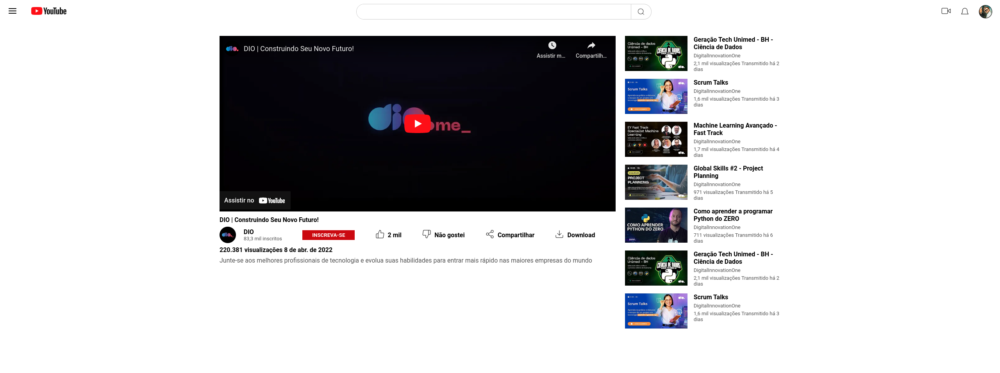

# Clone Youtube

## Contexto

Trata-se de um clone estático de uma página do Youtube com a finalidade de colocar em prática os conhecimentos sobre HTML, CSS (Flexbox).

## Stack utilizada

**Front-end:**
HTML, CSS (FlexBox)

## Screenshots

